# Hermes Bubbles

Messages-style chat bubbles for [Hermes Desktop](https://hermes-agent.nousresearch.com/), in light and dark.

Your messages sit on the right in a colored bubble that hugs the text, with a tail like in Messages. Hermes' replies sit on the left in grey bubbles, also with a tail; replies with code or tables get a wider bubble without one. Tool activity, approvals and status rows stay outside the bubbles, so long agent turns still read cleanly.

| Bubbles Blue, light | Bubbles Blue, dark |
| --- | --- |
|  |  |

| Bubbles Green, light | Bubbles Green, dark |
| --- | --- |
|  |  |

| Bubbles Graphite, light | Bubbles Graphite, dark |
| --- | --- |
| 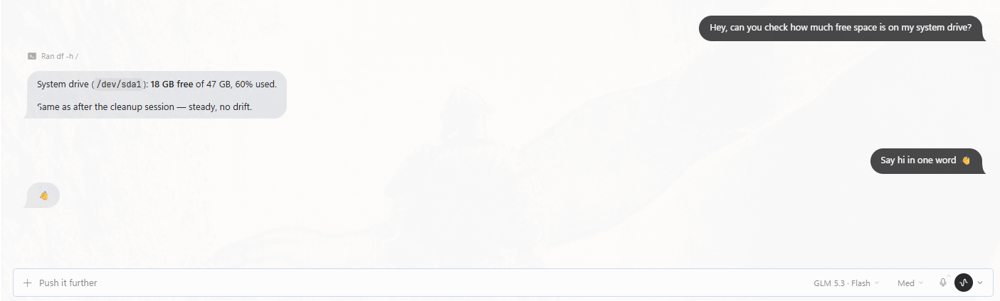 | 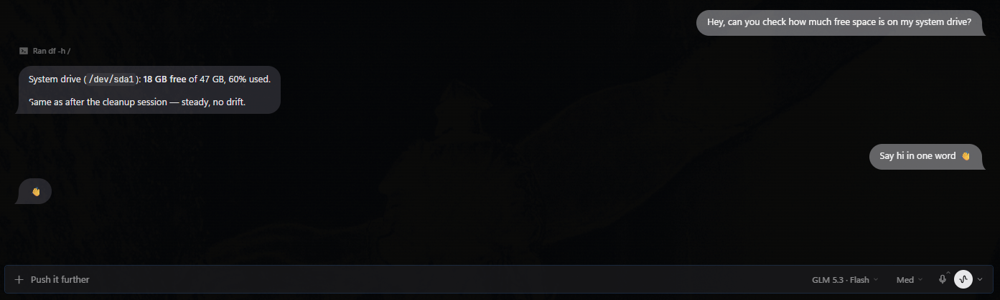 |

| Bubbles Grape, light | Bubbles Grape, dark |
| --- | --- |
| 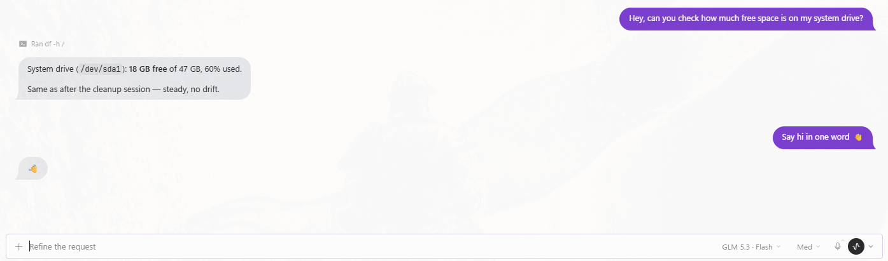 | 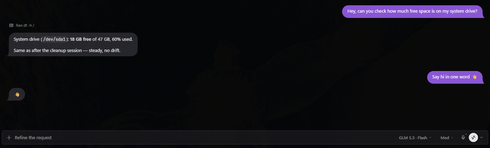 |

| Bubbles Sunset, light | Bubbles Sunset, dark |
| --- | --- |
| 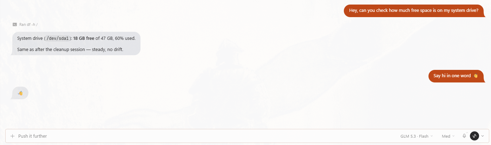 | 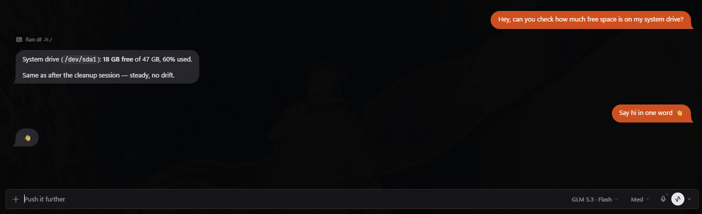 |

| Bubbles Midnight, light | Bubbles Midnight, dark |
| --- | --- |
| 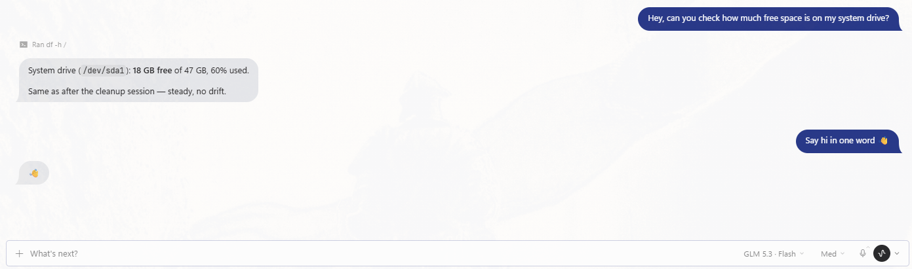 | 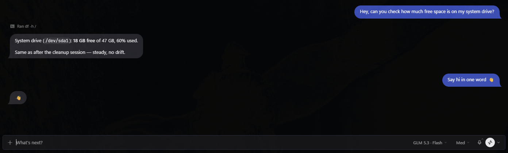 |

| Bubbles Bubblegum, light | Bubbles Bubblegum, dark |
| --- | --- |
| 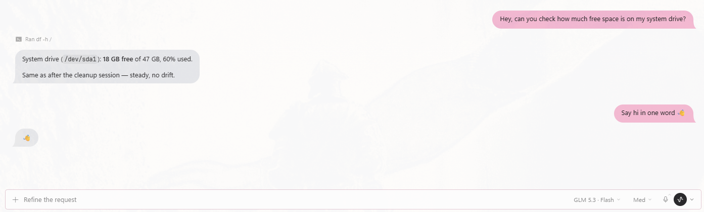 | 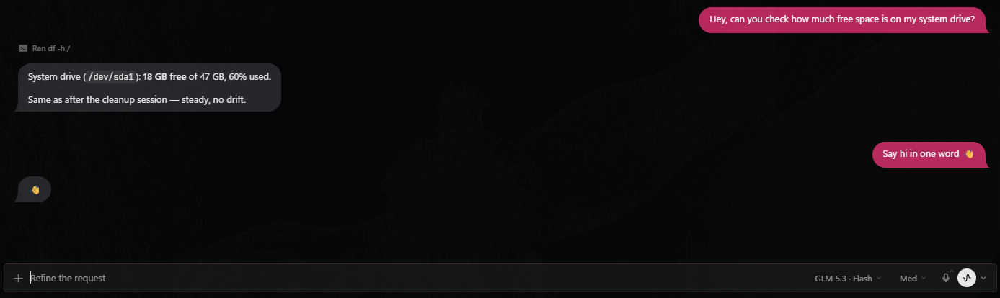 |

| Bubbles Mint, light | Bubbles Mint, dark |
| --- | --- |
| 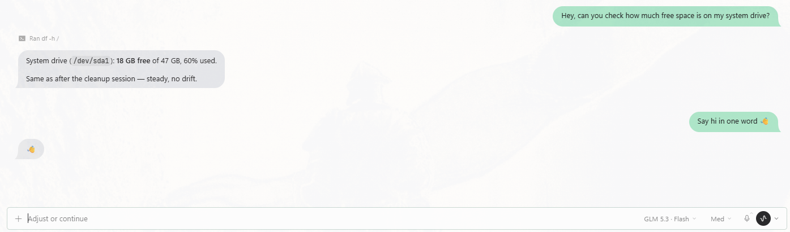 | 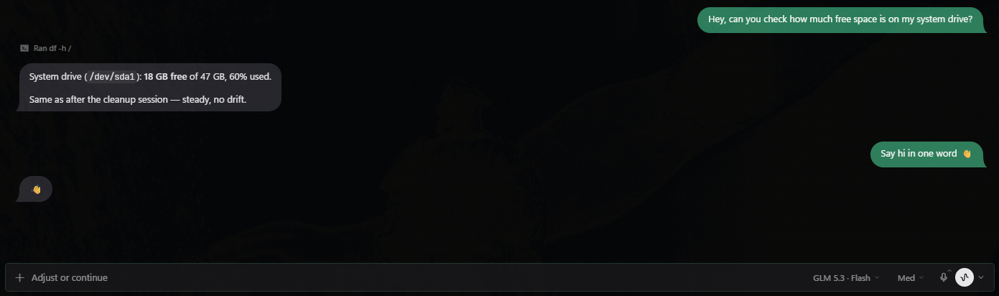 |

| Bubbles Peach, light | Bubbles Peach, dark |
| --- | --- |
| 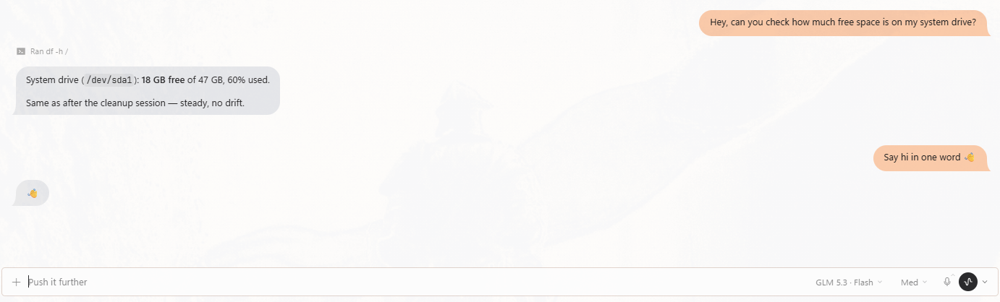 | 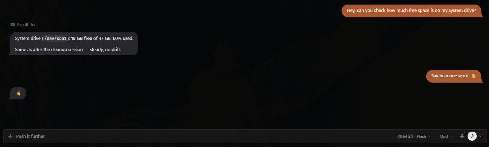 |

<sub>Screenshots from Hermes Desktop on Windows.</sub>

## Themes

- **Bubbles Blue**: classic Messages blue (`#007AFF` light, `#0A84FF` dark) with white text.
- **Bubbles Green**: SMS-style green (`#259A42`) with white text. A shade deeper than the stock SMS green so the text stays readable.
- **Bubbles Graphite**: neutral grey (`#48484A` light, `#636366` dark) with white text, for when you'd rather not have color.
- **Bubbles Grape**: rich purple (`#7B3FD1` light, `#8A55DB` dark) with white text.
- **Bubbles Sunset**: burnt orange (`#C8430B` light, `#D9480F` dark) with white text.
- **Bubbles Midnight**: deep navy (`#1E3A8A` light, `#2E4FB8` dark) with white text.
- **Bubbles Bubblegum**: pastel pink (`#F7B8D2`) with dark text in light mode; deep pink (`#C2185B`) with white text in dark mode.
- **Bubbles Mint**: pastel mint (`#A8E6C9`) with dark text in light mode; deep green (`#1A7F5A`) with white text in dark mode.
- **Bubbles Peach**: pastel peach (`#FFC9A8`) with dark text in light mode; deep peach (`#B4532A`) with white text in dark mode.

Every theme uses the same grey bubbles for Hermes' replies. The pastels switch to deeper shades in dark mode because a light pastel on a black screen glares, and white text on a pastel is unreadable.

Each theme has a light and a dark palette and follows Hermes' own light/dark/system mode (Shift+X toggles it).

## Install

Desktop plugins load from the computer that runs Hermes Desktop, not from the gateway. If your gateway runs on another machine (a VM, a server), install on the desktop machine.

### Windows (PowerShell)

```powershell
$dir = "$env:LOCALAPPDATA\hermes\desktop-plugins\hermes-bubbles"
New-Item -ItemType Directory -Force $dir | Out-Null
Invoke-WebRequest https://raw.githubusercontent.com/hutchins79/hermes-bubbles/v1.2.0/desktop/plugin.js -OutFile "$dir\plugin.js"
Select-String -Path "$dir\plugin.js" -Pattern "const VERSION"   # should print 1.2.0
```

Run all four lines in the same PowerShell window; `$dir` doesn't carry over to a new one.

This is the default Windows location (`C:\Users\<you>\AppData\Local\hermes`). If you set `HERMES_HOME`, use `$env:HERMES_HOME\desktop-plugins\hermes-bubbles` instead.

### macOS / Linux

```bash
dir="${HERMES_HOME:-$HOME/.hermes}/desktop-plugins/hermes-bubbles"
mkdir -p "$dir"
curl -fsSL https://raw.githubusercontent.com/hutchins79/hermes-bubbles/v1.2.0/desktop/plugin.js -o "$dir/plugin.js"
grep "const VERSION" "$dir/plugin.js"   # should print 1.2.0
```

If you set `HERMES_HOME`, it overrides `~/.hermes`.

### With the Hermes CLI

On the same machine as Hermes Desktop:

```bash
hermes plugins install hutchins79/hermes-bubbles --no-enable
hermes plugins enable hermes-bubbles
```

### Turn it on

1. Hermes Desktop picks up the plugin within a few seconds. If it doesn't, run **Reload desktop plugins** from the command palette.
2. Make sure **Hermes Bubbles** is enabled under **Capabilities → Plugins**.
3. Choose any **Bubbles** theme in **Settings → Appearance → Theme**.

## Update or remove

To update, re-run the install command with the newest version tag (see [tags](https://github.com/hutchins79/hermes-bubbles/tags)), then **Reload desktop plugins**. Installing from a tag avoids GitHub's few-minute cache on `main`, which can hand you the previous version right after a release. To remove, switch to another theme first, then delete the `hermes-bubbles` folder from `desktop-plugins` (or run `hermes plugins remove hermes-bubbles`).

## How it works

`desktop/plugin.js` registers nine themes through the Desktop plugin SDK's `THEMES_AREA`. Each theme carries:

- `colors` and `darkColors`: the light and dark palettes: Apple's system greys for the window, plus the theme's bubble and accent colors.
- `typography`: the system UI font (SF Pro on macOS, Segoe UI on Windows). No fonts are bundled or downloaded.
- `customCSS`: the bubble layout. Hermes injects it when the theme is applied and removes it when you switch away, so the plugin never touches the DOM itself.

The CSS targets the transcript's own hooks (`.composer-human-message` and the assistant `.aui-md` prose block). If a Hermes update renames those, the palettes keep working and only the bubble shapes fall back to Hermes' defaults.

The **Message Bubble** transparency slider in Settings → Appearance still works.

## Development

No build step. Edit `desktop/plugin.js` in place under `desktop-plugins/hermes-bubbles/` and Hermes hot-reloads it.

```bash
node --check desktop/plugin.js
hermes plugins validate .   # passes on v1.2.0
```

Issues and pull requests are welcome, especially screenshots from real Hermes Desktop setups.

## Roadmap

Ideas, not promises:

- **Closer font match:** an opt-in variant that loads Inter (a free font close to SF Pro) through the theme's `fontUrl`. Off by default so the default themes stay download-free.
- **Grouping:** tighter corners and a single tail when several messages in a row come from the same side.
- **More screenshots:** code blocks, tables and the inline edit view.
- **CLI/TUI skin** to match the desktop theme.

## Credits

Inspired by [Minimalist Themes for Hermes](https://github.com/mykeura/minimalist-themes-for-hermes) by @mykeura.

Not affiliated with Apple or Nous Research. Messages and iMessage are trademarks of Apple Inc.

## License

MIT
