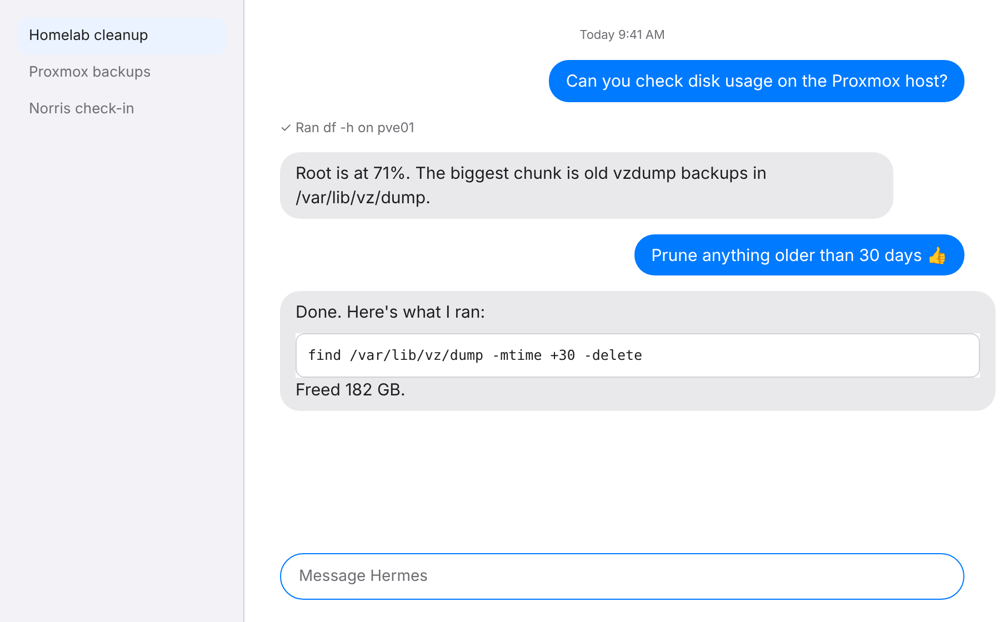
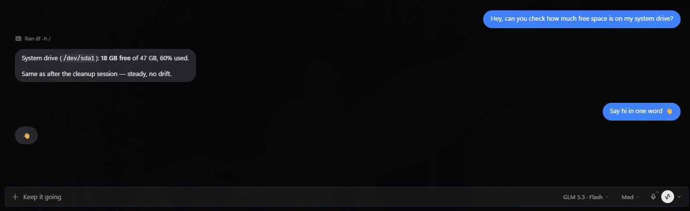
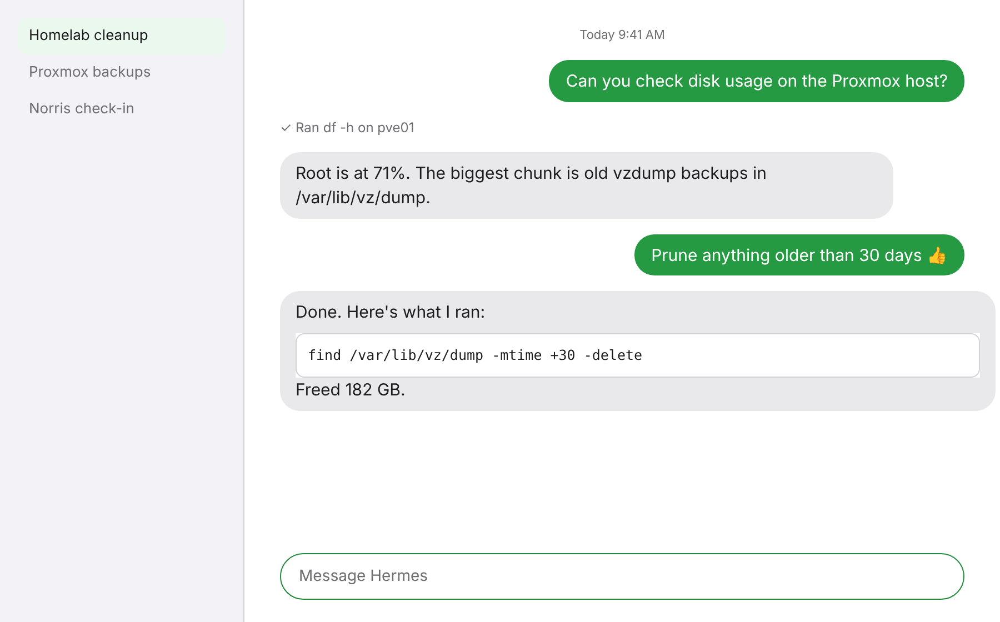
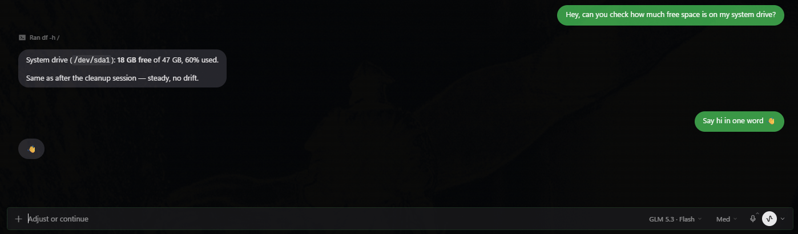

# Hermes Bubbles

Messages-style chat bubbles for [Hermes Desktop](https://hermes-agent.nousresearch.com/), in light and dark.

Your messages sit on the right in a colored bubble that hugs the text. Hermes' replies sit on the left in grey bubbles. Tool activity, approvals and status rows stay outside the bubbles, so long agent turns still read cleanly.

| Bubbles, light | Bubbles, dark |
| --- | --- |
|  |  |

| Bubbles Green, light | Bubbles Green, dark |
| --- | --- |
|  |  |

<sub>Screenshots from Hermes Desktop on Windows.</sub>

## Themes

- **Bubbles**: classic blue sent bubbles, grey received bubbles.
- **Bubbles Green**: SMS-style green sent bubbles. The green is a shade deeper than the stock one so white text stays readable.
- **Bubbles Graphite**: neutral grey sent bubbles, for when you'd rather not have color.

Each theme has a light and a dark palette and follows Hermes' own light/dark/system mode (Shift+X toggles it).

## Install

Desktop plugins load from the computer that runs Hermes Desktop, not from the gateway. If your gateway runs on another machine (a VM, a server), install on the desktop machine.

### Windows (PowerShell)

```powershell
$dir = "$env:LOCALAPPDATA\hermes\desktop-plugins\hermes-bubbles"
New-Item -ItemType Directory -Force $dir | Out-Null
Invoke-WebRequest https://raw.githubusercontent.com/hutchins79/hermes-bubbles/main/desktop/plugin.js -OutFile "$dir\plugin.js"
```

This is the default Windows location (`C:\Users\<you>\AppData\Local\hermes`). If you set `HERMES_HOME`, use `$env:HERMES_HOME\desktop-plugins\hermes-bubbles` instead.

### macOS / Linux

```bash
dir="${HERMES_HOME:-$HOME/.hermes}/desktop-plugins/hermes-bubbles"
mkdir -p "$dir"
curl -fsSL https://raw.githubusercontent.com/hutchins79/hermes-bubbles/main/desktop/plugin.js -o "$dir/plugin.js"
```

If you set `HERMES_HOME`, it overrides `~/.hermes`.

### With the Hermes CLI

On the same machine as Hermes Desktop:

```bash
hermes plugins install hutchins79/hermes-bubbles --no-enable
hermes plugins enable hermes-bubbles
```

### Turn it on

1. Hermes Desktop picks up the plugin within a few seconds. If it doesn't, run **Reload desktop plugins** from the command palette.
2. Make sure **Hermes Bubbles** is enabled under **Capabilities → Plugins**.
3. Choose **Bubbles** or **Bubbles Green** in **Settings → Appearance → Theme**.

## Update or remove

Re-run the install command to update. To remove, switch to another theme first, then delete the `hermes-bubbles` folder from `desktop-plugins` (or run `hermes plugins remove hermes-bubbles`).

## How it works

`desktop/plugin.js` registers three themes through the Desktop plugin SDK's `THEMES_AREA`. Each theme carries:

- `colors` and `darkColors`: the light and dark palettes (Apple system greys, blue `#007AFF` / `#0A84FF`).
- `typography`: the system UI font (SF Pro on macOS, Segoe UI on Windows). No fonts are bundled or downloaded.
- `customCSS`: the bubble layout. Hermes injects it when the theme is applied and removes it when you switch away, so the plugin never touches the DOM itself.

The CSS targets the transcript's own hooks (`.composer-human-message` and the assistant `.aui-md` prose block). If a Hermes update renames those, the palettes keep working and only the bubble shapes fall back to Hermes' defaults.

The **Message Bubble** transparency slider in Settings → Appearance still works.

## Development

No build step. Edit `desktop/plugin.js` in place under `desktop-plugins/hermes-bubbles/` and Hermes hot-reloads it.

```bash
node --check desktop/plugin.js
hermes plugins validate .   # passes on v1.0.0
```

Issues and pull requests are welcome, especially screenshots from real Hermes Desktop setups.

## Roadmap

Ideas, not promises:

- **Closer font match:** an opt-in variant that loads Inter (a free font close to SF Pro) through the theme's `fontUrl`. Off by default so the default themes stay download-free.
- **Grouping:** tighter corners and a single tail when several messages in a row come from the same side.
- **More screenshots:** code blocks, tables and the inline edit view.
- **CLI/TUI skin** to match the desktop theme.

## Credits

Inspired by [Minimalist Themes for Hermes](https://github.com/mykeura/minimalist-themes-for-hermes) by @mykeura.

Not affiliated with Apple or Nous Research. Messages and iMessage are trademarks of Apple Inc.

## License

MIT
